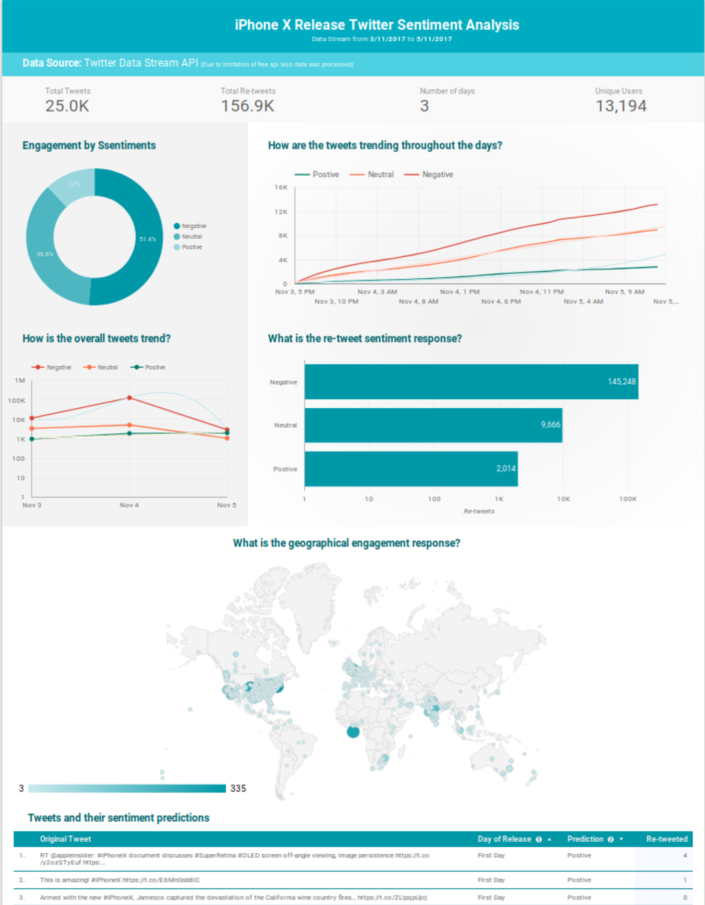

# Twitter sentiment analysis using Avro with Apache Kafka and Apache Spark on HDInsight (or Local)

This is an illustration of streaming Avro data from Kafka on HDInsight to a Spark on HDInsight cluster and then using Stanford Core NLP library to predict sentiment of tweets. Finally exposing the resulting data in Google Data Studio. 

You can see the final results [here.](https://datastudio.google.com/open/1YUeVXkIGJtJU6pCgBgXPzlzkkZka5nSE)

## Understand this example

__To run this on your local machine you will need:__

* [Ubuntu 17.04 or greater OS](https://www.osboxes.org/ubuntu/)
* [Kafka](https://www.digitalocean.com/community/tutorials/how-to-install-apache-kafka-on-ubuntu-14-04)
* [Confluent Schema Registry](https://www.confluent.io/) (Installed by provision.sh)
* [Spark](https://spark.apache.org/) (Imported by IntelliJ IDEA)
* [Stanford Core NLP](https://stanfordnlp.github.io/CoreNLP/) (Imported by IntelliJ IDEA)
* [Twitter4j API](http://twitter4j.org/en/) (Imported by IntelliJ IDEA)
* Scala

1. Make sure you have kafka on your OS and run provision.sh
2. Create a twitter app and replace keys and secrets in code.
3. Start Kafka 
4. Start Schema Registry (Refer to Run Schema Registry Below)
5. Use terminal or IDE to build and run scala sbt producers and consumers

- *You can look at azure cluster tutorial below for detailed understanding*

__To run this on Azure clusters:__

This example uses two Scala applications that you will run on HDInsight 3.5. The code relies on the following components:

* __Two HDInsight clusters__: Apache Kafka and Spark are available as two different cluster types. HDInsight cluster types are tuned for the performance of a specific technology; in this case, Kafka and Spark. To use both together, we will create an Azure Virtual network and then create both a Kafka and Spark cluster on the virtual network.

* __Kafka brokers__: The broker process runs on each workernode on the Kafka cluster. The list of brokers is required by the producer component, which writes data to Kafka.

* __Schema Registry__: As Avro is a schema-base serialization scheme, we use the [Confluent Schema Registry](http://docs.confluent.io/current/schema-registry/docs/intro.html) to maintain the schemas in a robust manner between producer and consumer. We also use the Confluent Avro Kafka Serializer, that prepends Avro data with the unique (versioned) identifier of the schema in the registry. This allows schema evolutions in a robust manner:

| magic number | schema id | Avro data |
| ------------ | --------- | --------- |
| 0x00 | 0x00 0x00 0x00 0x01 | bytes... |

* A __Producer application__: The `spark-twitter-produce` standalone application uses Twitter to populate data in Kafka. If you do not have a Twitter app set up, visit [](https://apps.twitter.com) to create one.

* A __Consumer Spark application__: The `spark-twitter-consume` Spark application consumes data from Kafka as streams pre-process the data and using Stanford Core NLP Predicts the sentiments of tweets and write resutls into CSV or Parquet files. We use Kafka DStreams and Spark Streaming.

* __Google Data Studio__: We will consume the data from Spark into a dashboard.

*Also can use*

* __Hive__: We will configure an external table in Hive to expose the Parquet files as a table.

* __Power BI__: We will consume the data from Spark into an interactive dashboard.

## To run this example

### Get Twitter API credentials

Navigate to the [Twitter Developers website](https://apps.twitter.com), sign in with your Twitter account credentials, and click Create New App. Follow the steps and take note of the generated credentials.

### Deploy ARM Template

In The Azure portal, select **New** -> **Template deployment** (or navigate directly to [Template deployment](https://portal.azure.com/#create/Microsoft.Template)). Click **Build your own template in the editor**, then **Load file** and upload the "create-linux-based-kafka-spark-cluster-in-vnet.json" file from this solution, then **Save**. Fill in the parameters and click **Purchase**.

You will be notified in the portal after about 15 minutes that the solution has been deployed.


### Provision required programs on the Spark cluster

Navigate to your [HDInsight clusters](https://portal.azure.com/#blade/HubsExtension/Resources/resourceType/Microsoft.HDInsight%2Fclusters). Click on your "spark-BASENAME" cluster, then **Secure Shell (SSH)** and follow the instructions to SSH to your Spark cluster.

On the Spark cluster, clone the project and install the required tooling (SBT and Schema Registry):
```bash
git clone https://github.com/epicprojects/twitter-sentiment-analysis
cd hdinsight-kafka-spark
./provision.sh
```

### Get Kafka host information

In your SSH session, use the following commands to retrieve the broker and Zookeeper information. Replace __PASSWORD__ with the login (admin) password you used when creating the cluster. Replace __BASENAME__ with the base name you used when creating the cluster.

* To get the __Kafka broker__ information:

        curl -u admin:PASSWORD -G "https://kafka-BASENAME.azurehdinsight.net/api/v1/clusters/kafka-BASENAME/services/KAFKA/components/KAFKA_BROKER" | jq -r '["\(.host_components[].HostRoles.host_name):9092"] | join(",")'

    When using this command from Windows PowerShell, you may receive an error about shell quoting. If so, use the following command:

        curl -u admin:PASSWORD -G "https://kafka-BASENAME.azurehdinsight.net/api/v1/clusters/kafka-BASENAME/services/KAFKA/components/KAFKA_BROKER" | jq -r '["""\(.host_components[].HostRoles.host_name):9092"""] | join(""",""")

* To get the __Zookeeper host__ information:

        curl -u admin:PASSWORD -G "https://kafka-BASENAME.azurehdinsight.net/api/v1/clusters/kafka-BASENAME/services/ZOOKEEPER/components/ZOOKEEPER_SERVER" | jq -r '["\(.host_components[].HostRoles.host_name):2181"] | join(",")'

    When using this command from Windows PowerShell, you may receive an error about shell quoting. If so, use the following command:

        curl -u admin:PASSWORD -G "https://kafka-BASENAME.azurehdinsight.net/api/v1/clusters/kafka-BASENAME/services/ZOOKEEPER/components/ZOOKEEPER_SERVER" | jq -r '["""\(.host_components[].HostRoles.host_name):2181"""] | join(""",""")'

Both commands return information similar to the following text:

* __Kafka brokers__: `wn0-kafka.4rf4ncirvydube02fuj0gpxp4e.ex.internal.cloudapp.net:9092,wn1-kafka.4rf4ncirvydube02fuj0gpxp4e.ex.internal.cloudapp.net:9092`

* __Zookeeper hosts__: `zk0-kafka.4rf4ncirvydube02fuj0gpxp4e.ex.internal.cloudapp.net:2181,zk1-kafka.4rf4ncirvydube02fuj0gpxp4e.ex.internal.cloudapp.net:2181,zk2-kafka.4rf4ncirvydube02fuj0gpxp4e.ex.internal.cloudapp.net:2181`

Save this information; you will need it for configuring the applications.


### Run Schema Registry

On the Spark head node, first create a customized configuration file:

```bash
cp /etc/schema-registry/schema-registry.properties .
```

Use your favorite Unix editor to edit the file schema-registry.properties . You'll need to set **kafkastore.connection.url** to your Zookeeper hosts determined above (**Not your Kafka brokers**).

Then run the Schema Registry:

```bash
schema-registry-start schema-registry.properties
```

Leave the schema registry running.

### Run the Producer program to stream tweets to Kafka

In parallel, open a second SSH shell to the Spark server.

Compile and run the Producer program.

**NB**:
The first time, the program might fail with an error message but will create a default configuration file ../application.properties for you to edit.

```bash
cd hdinsight-kafka-spark
cd spark-twitter-produce
sbt run
```

Use your favorite Unix editor to edit the file ../application.properties .

At a minimum you will need to fill the **kafka.brokers** line with the brokers, and your Twitter authentication information.

Run the program again:

```bash
sbt run
```

You should see that Tweets are sent to Kafka. Leave the session running.


### _(Optional)_ View the Kafka stream

Run the following command, replacing KAFKA_BROKER with your Kafka broker endpoint:

```bash
kafka-console-consumer --bootstrap-server KAFKA_BROKER --topic tweets --from-beginning | xxd | head -20
```

You should see output in hex format. The xxd command shows the hex content of the stream, and the content in ASCII on the right (replaced by `.' for non-printable characters).


### Run the Consumer program to stream tweets from Kafka to Spark

In parallel, open a third SSH shell to the Spark server.

```bash
cd hdinsight-kafka-spark
cd spark-twitter-consume
sbt assembly
```

Now that we have assembled our Spark application package, we submit it as a Spark 2 job:

```bash
export SPARK_HOME=/usr/hdp/current/spark2-client
export SPARK_MAJOR_VERSION=2
spark-submit target/scala-2.11/spark-twitter-consume-assembly-1.0.jar
```

The job will run for a few minutes and create every few seconds Parquet files on HDFS, at the location defined in your properties file (by default /twitter/tweets.parquet).

We can inspect the files as follows:

```bash
hdfs dfs -ls -R /twitter
```

You should see output similar to the following:

```text
drwxr-xr-x   - sshuser supergroup          0 2017-08-31 22:30 /twitter/tweets.parquet
-rw-r--r--   1 sshuser supergroup          0 2017-08-31 22:30 /twitter/tweets.parquet/_SUCCESS
drwxr-xr-x   - sshuser supergroup          0 2017-08-31 22:28 /twitter/tweets.parquet/year=2017
drwxr-xr-x   - sshuser supergroup          0 2017-08-31 22:28 /twitter/tweets.parquet/year=2017/month=8
drwxr-xr-x   - sshuser supergroup          0 2017-08-31 22:30 /twitter/tweets.parquet/year=2017/month=8/day=31
-rw-r--r--   1 sshuser supergroup       2029 2017-08-31 22:30 /twitter/tweets.parquet/year=2017/month=8/day=31/part-r-00000-17c74d4a-e48f-46e3-8278-f0b9f0d1d887.snappy.parquet
-rw-r--r--   1 sshuser supergroup       1795 2017-08-31 22:29 /twitter/tweets.parquet/year=2017/month=8/day=31/part-r-00000-20ae45d5-2f24-4da4-8c42-20e0488d7ecc.snappy.parquet
```
### Export Spark data to CSV

You can also export your output to a CSV File and then later use that file to process it or create a report from it.


### Expose Spark data from Hive

On the Azure portal, navigate to your Spark cluster, and Select Ambari views from the Quick Links section, then Hive view.

When prompted, enter the cluster login (default: _admin_) and password used when you created the cluster.

Run the following queries one after the other.

First we create a Hive **external table** referencing the Parquet files on HDFS.

```sql
DROP TABLE IF EXISTS tweets ;
CREATE EXTERNAL TABLE tweets (id BIGINT, createdAt STRING, lang STRING, retweetCount INT, text STRING, location STRING)
PARTITIONED BY (year INT, month INT, day INT)
STORED AS PARQUET LOCATION '/twitter/tweets.parquet';
```

Before executing the query below, change the values for year, month and day to the date you ran the Spark application (as seen in the Parquet file partitions):

```sql
ALTER TABLE tweets ADD PARTITION(year=2017, month=8, day=31);
```

Let's see a sample of data from that table:

```sql
SELECT * FROM tweets LIMIT 5;
```

You should see a sample of the Tweet data.

### Consume data in Google Data Studio

Open Google data studio and import the CSV output file to create a report. Alternatively you can also use Microsoft Power BI to hook your hive cluster data to Power BI by opening Power BI Desktop Application and Select **Get Data**, then **Azure HDInsight Spark**. Enter your Spark server (CLUSTERNAME.azurehdinsight.net) and your admin credentials.

You can now design and publish a dashboard from your data.



## Inspect the code

* [Producer code](spark-twitter-produce/src/main/scala/produce.scala)
* [Consumer code](spark-twitter-consume/src/main/scala/consume.scala)
* [Avro schema](spark-twitter-produce/src/main/resources/avro/twitter.avsc)


